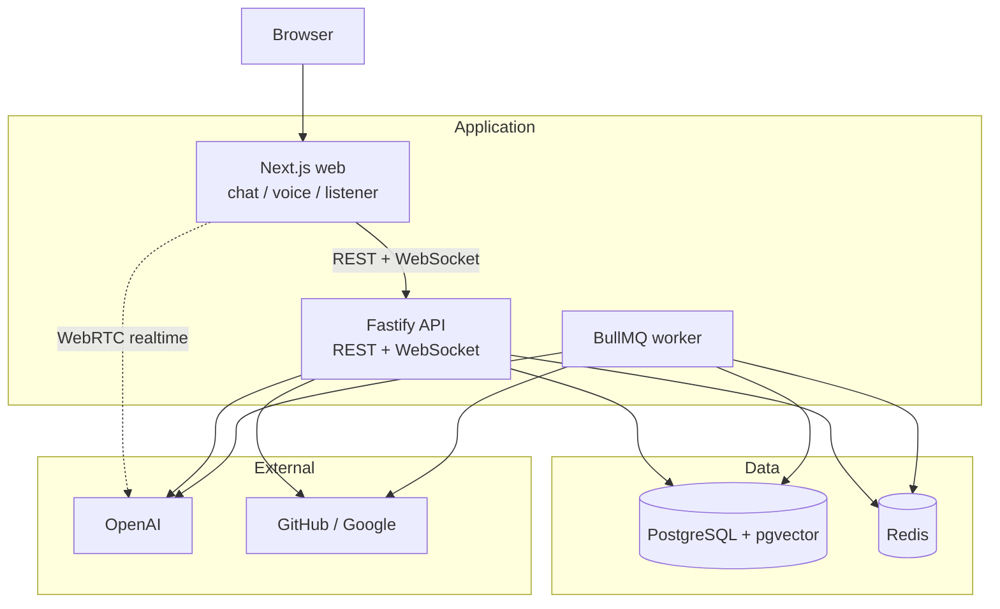

# Agentic AI Assistant

Agentic AI Assistant (AAA) is a self-hosted personal AI workspace with chat, voice, retrieval over connected data sources, persistent memory, and native tool execution.

The main idea behind the project is to make the assistant’s intelligence portable. Personalization, memory, connected data, and tool workflows live in the application rather than inside a single model provider’s ecosystem. That means the assistant can adopt newer or better models over time without forcing the user to rebuild their context, preferences, or workflow history. By keeping that context in user-owned storage, the assistant can provide a more durable personal layer without depending on any one vendor to preserve it.

## Features

- Chat interface with persistent conversation history
- Multi-agent orchestration for routing, research, tool use, coding tasks, and verification
- Voice mode with live transcription and spoken responses
- Retrieval-augmented answers over connected data sources
- Persistent personalization, preferences, and long-term memory
- Native tool execution with approval flow for sensitive actions

### Multi-Agent System

The assistant uses a small multi-agent architecture around each assistant turn:

- **Orchestrator** — Routes requests and decides whether to answer directly or delegate
- **Research Agent** — Synthesizes answers from retrieved context
- **Tool Agent** — Prepares tool calls for live reads, writes, and external operations
- **Coding Agent** — Handles GitHub coding tasks through an isolated worker checkout
- **Verifier Agent** — Checks the final output for safety, grounding, and approval requirements

### Live Voice

Live voice makes the assistant feel more natural to work with by letting users talk through ideas, ask follow-up questions, and keep a conversational flow without leaving the chat experience.

### Personalization

Personalization settings control both assistant behavior and long-term memory. Communication preferences, such as tone and writing style, and durable memories, such as facts, relationships, and important people, are stored in personal, portable context that carries across conversations.

### Connected Apps

Provider apps connect once per external provider and expose separate internal capabilities:

- **Knowledge** — Used for sync, indexing, and retrieval, such as using docs or repository context for RAG
- **Tools** — Used for live tool access and side-effectful operations, such as editing docs in Google Drive or making code changes in a GitHub repository

## Architecture

AAA keeps conversations, memory, connected apps, and tool workflows in user-owned storage, and treats the chat model as a swappable backend. The Next.js web app talks to a Fastify API over REST and WebSocket. Chat turns run through a multi-agent orchestrator. Voice and Listener Mode mint OpenAI Realtime sessions on the API, then stream audio over WebRTC. A BullMQ worker handles ingestion, embeddings, app sync, and tool execution. PostgreSQL with pgvector stores app data, attachments, memory, and embeddings; Redis backs the job queues.



Text chat streams tokens and tool events over WebSocket. When an agent stages a tool call, the API records it, requests approval if needed, and enqueues execution on the worker. After a non-voice tool finishes, a chat-continuation job returns to the API so the orchestrator can continue the turn. Connected apps split into knowledge (sync, index, retrieve) and tools (live reads and writes against GitHub and Google).

Shared packages own the seams between apps: agent orchestration, the model gateway, retrieval, tools, knowledge-source sync, memory, database access, and queues. Chat models can be swapped without changing those layers. Voice and Listener Mode use a realtime path and do not go through the chat-provider gateway.

Production runs the web, API, worker, and data services on a single host behind a reverse proxy. See the infrastructure docs for deploy details.

## Local Development Setup

### Prerequisites

- **Node.js** >= 20
- **pnpm** >= 9
- **Docker** and **Docker Compose** (for local services)
- **Model provider API key**
- **WSL or Git Bash on Windows** recommended for local app startup

### Clone The Repository

```bash
git clone https://github.com/your-org/agentic-ai-assistant.git
cd agentic-ai-assistant
```

### Configure The Environment

```bash
cp .env.example .env
# Edit .env and add your real values
```

See `.env.example` for the full template.

### Install Dependencies

```bash
pnpm install
```

### Start The App

```bash
pnpm dev:local
```

That command handles the local startup flow for you.

### Verify It’s Working

- Open `http://localhost:3000`
- Check API health at `http://localhost:3001/health`
- Use development login from the home page when `NODE_ENV` is not `production`

### Local Observability

`pnpm dev:local` also starts the local observability stack with Grafana, Prometheus, Loki, and Tempo. App, API, worker, metrics, and dashboard endpoints are exposed locally for debugging and development.

## License

This project is licensed under the [GNU General Public License v3.0](LICENSE).
